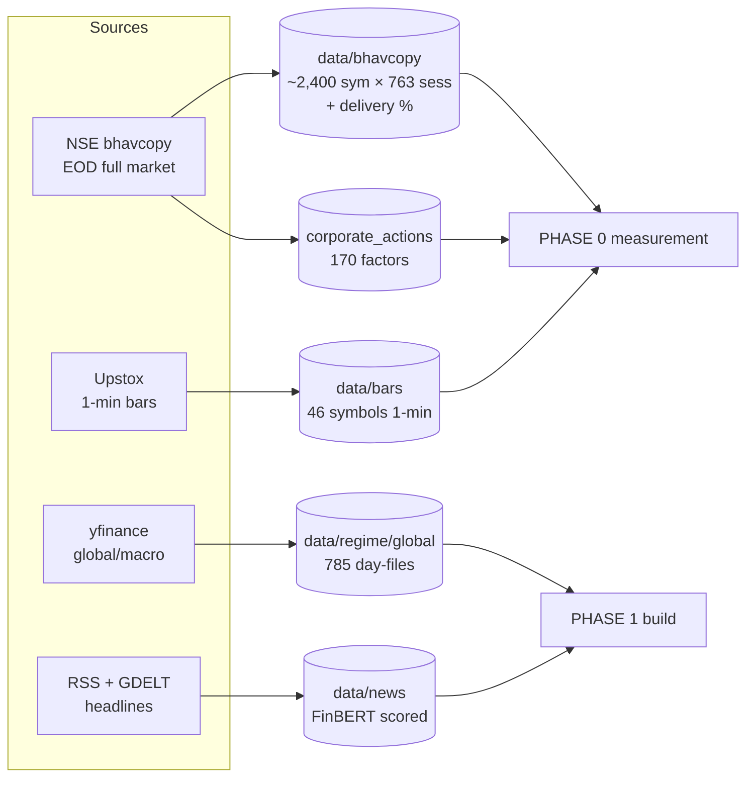
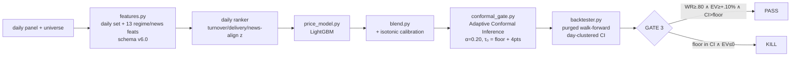

# Solution Flow — End to End

> **What this is:** the complete data-and-decision flow of the NSE selective
> trading-signal system, from raw exchange data to a capital decision — and the
> pre-registered gates that can stop it at each step.
>
> **Current status (2026-07-10):** the project is **STOPPED**. Phase 0 fired a
> pre-registered **KILL** (0 of 48 geometry cells passed), the user elected STOP,
> and the KILL has since been **reproduced bit-for-bit**. Everything past Phase 0
> in this document is the *designed* flow that was never entered — it is
> documented here for completeness and for any future re-contract.
>
> **Authoritative spec:** [PLAN_v6.md](archive/PLAN_v6.md). Lineage & history: [README.md](README.md).

---

## 0. The governing idea (read this first)

This is **not** "predict every stock's direction." It is a **selective** system:
stay silent unless a calibrated probability clears a gate, and **engineer the win
rate with barrier geometry** rather than demanding it from prediction.

Two numbers define success (the frozen contract, [PLAN_v6.md](archive/PLAN_v6.md#L94-L104)):

| Quantity | Contract |
|---|---|
| Win rate on emitted signals | ≥ 0.80 (point) AND day-clustered 95% CI lower ≥ the **measured** geometry floor |
| Post-cost expectancy | ≥ +0.10%/trade at ₹1L AND day-clustered CI lower > 0 |
| Direction | **Long-only** (retail cannot hold overnight cash shorts on NSE) |

The whole architecture exists to answer, **cheaply and before any capital**, the
load-bearing question: *does the geometry floor actually materialize on real price
paths at this horizon?* Every prior version died because it built first and
measured later — so v6 **measures first**.

```
Raw exchange data ─► [PHASE 0] measure feasibility ─► GATE (GO/KILL)
                                                        │
                          KILL ◄────────────────────────┤ (← we are here)
                                                        │
                                                        GO
                                                        ▼
                     [PHASE 1] build + backtest ─► GATE 3 ─► [PHASE 2] paper ─► GATE 4/5 ─► capital
```

---

## 1. Lineage — why the flow is shaped this way

Each prior version violated one rule; v6's flow is the accumulated response
([PLAN_v6.md §1](archive/PLAN_v6.md#L36-L42), [README.md](README.md#L105-L110)).

| Plan | Horizon | Died because | Flow fix carried into v6 |
|---|---|---|---|
| v1 | daily 5-class | chased "max accuracy" ≈ baseline | accuracy **banned**; selective contract |
| v3 | intraday | 89%-by-geometry premise never measured | executable gates compute the contract metric |
| v4 | intraday | geometry floor didn't materialize on 1-min paths (Gate 2) | **measure first**; horizon change |
| **v6** | **1–5 day swing** | Phase 0 KILL: floor tops out at 0.711 < 0.72 band | *(this document)* |

**~70% of the code is reused across versions** — the data moat, labeler,
backtester, gates, risk, and serving layers all carry forward; only the horizon
(barrier widths + hold window) and the feature altitude change.

---

## 2. The data layers (the moat — shared by every phase)

All downstream flow reads from these Point-In-Time (PIT) stores. Nothing here
looks into the future.



| Store | Path | Built by | Role in flow |
|---|---|---|---|
| Bhavcopy (EOD full market) | `data/bhavcopy/` | `src/intraday/bhavcopy.py` | daily panel + PIT liquidity universe |
| Corp actions | `data/processed/` | [src/intraday/corporate_actions.py](src/intraday/corporate_actions.py) | back-adjust prices (F19) |
| 1-min bars (46 names) | `data/bars/` | [src/intraday/data_feed.py](src/intraday/data_feed.py) | tie-break truth vs daily OHLC |
| Regime (global/macro) | `data/regime/global/` | [src/intraday/regime_data.py](src/intraday/regime_data.py) | Phase-1 features |
| News (RSS+GDELT+FinBERT) | `data/news/` | [src/intraday/news_regime.py](src/intraday/news_regime.py) | Phase-1 features (forward-only) |

**PIT discipline** is enforced structurally, not by convention: ATR is
strictly-trailing ([src/v6/panel.py](src/v6/panel.py)), the universe is recomputed
monthly from *trailing-only* turnover ([src/v6/universe.py](src/v6/universe.py)),
and a signal decided at day D's close never sees D+1.

---

## 3. PHASE 0 — Feasibility Measurement (the decision gate) ✅ *this ran*

**Goal:** measure — not assume — whether an 80% win rate can be engineered by
geometry, long-only, at ≤5-day holds, and price the model edge required to beat
costs. Compute only; **no system is built.** ([PLAN_v6.md §4](archive/PLAN_v6.md#L107-L239))

### 3.1 Execution order (F21: cost curve is frozen *before* any cell is scored)

```mermaid
flowchart TD
    A[v6_cost_curve.py\n§4.4 c(size) + min-viable-size] --> B
    B[v6_phase0_grid.py\n§4.1 panel + PIT universe\n§4.2 labeler\n§4.3 48-cell grid\n§4.5 gap risk] --> D
    C[v6_tiebreak_study.py\n§4.2 daily-OHLC vs 1-min truth] --> D
    E[v6_gdelt_probe.py + v6_earnings_probe.py\n§4.6/4.6b news + earnings PIT\n(non-gate-binding)] -.-> D
    D[v6_phase0_report.py\nassemble + evaluate frozen §4.7 v2] --> V{GO / KILL}
    V -->|0 cells pass 1-4| KILL[❌ KILL]
```

| Step | Script | Produces | Reads |
|---|---|---|---|
| Costs | [scripts/v6_cost_curve.py](scripts/v6_cost_curve.py) | `reports/v6/cost_curve.json`, `phase0_cost_curve.md` | [src/v6/costs.py](src/v6/costs.py), config |
| Grid | [scripts/v6_phase0_grid.py](scripts/v6_phase0_grid.py) | `grid_long.parquet`, `gap_risk.json`, `labels_sample.parquet` | panel, universe, labeler, cost_curve |
| Tie-break | [scripts/v6_tiebreak_study.py](scripts/v6_tiebreak_study.py) | `tiebreak_study.json` | `data/bars/` (1-min) |
| Probes | [scripts/v6_gdelt_probe.py](scripts/v6_gdelt_probe.py), [scripts/v6_earnings_probe.py](scripts/v6_earnings_probe.py) | `gdelt_probe_summary.json`, `earnings_probe.json` | live archives |
| Report | [scripts/v6_phase0_report.py](scripts/v6_phase0_report.py) | **`reports/v6/phase0_report.md`** | all of the above |

### 3.2 Inside the grid run (the load-bearing measurement)

```
load_panel()               → 1.54M rows, 2,906 symbols, CA-adjusted, trailing ATR(14)
   │  src/v6/panel.py
   ▼
monthly_pit_universe()     → top-100 by trailing 6-mo turnover, recomputed monthly
   │  src/v6/universe.py       (survivorship-free; surveillance/circuit-lock proxy excluded)
   ▼
label_universe(cell)  ×48  → triple-barrier resolve for a∈{.5,.75,1,1.5} × b∈{2,3,4,5} × H∈{2,3,5}
   │  src/v6/labeler.py        entry = next open; target +a·ATR; stop −b·ATR; time exit at close(D+H)
   ▼                           conservative dual-touch ⇒ STOP; gap-through fills at the open
per-cell stats + criteria  → pooled/half/yearly WR · exit mix · empirical δ · gap risk · short mirror
   │  src/v6/grid.py           empirical δ: solve E(q*)=q·r_win+(1−q)·r_loss−c = 0  (prices time-exits, F11)
   ▼
frozen §4.7 v2 evaluation  → 6 criteria, thresholds hard-coded & immutable in src/v6/grid.py
```

### 3.3 The frozen gate (§4.7 v2 — approved & frozen *before* measurement)

Hard-coded in [src/v6/grid.py](src/v6/grid.py) so it cannot be tuned after seeing results:

| # | Criterion | Threshold |
|---|---|---|
| 1 | ≥1 cell pooled WR in band | **[0.72, 0.79]** |
| 2 | plateau: halves ±3pts, worst year ≥ 0.70, neighbors ±3pts | robustness |
| 3 | geometry genuinely exercised | stop-hit ≥ 10% AND time-exit ≤ 40% |
| 4 | empirical required δ | ≤ 4.0 pts @1× AND ≤ 6.0 pts @2× stress |
| 5 | gap risk bounded | loss beyond stop ≤ 25% of stop distance |
| 6 | tie-break bias (OHLC vs 1-min) | ≤ 5 pts |

### 3.4 Outcome — ❌ KILL `[MEASURED 2026-07-08, reproduced 2026-07-10]`

```
Criterion 1: 0 cells in band     — best cell a0.5_b5_h5 pooled WR = 0.711  (< 0.72 floor)
Criterion 4: 0 cells             — min empirical δ = 6.3 pts @1×           (> 4.0 ceiling)
             ──────────────────────────────────────────────────────────────────────
             VERDICT: KILL — "selective-signal-by-geometry does not work
                             long-only on NSE at ≤5-day holds."
```

**Two binding walls:** (1) the WR surface tops out ~0.71 and never reaches the
band; (2) payoff asymmetry — wide-stop/narrow-target cells buy win rate at the
price of catastrophic per-stop loss, and the measured exit mix prices that in.
Full evidence: [reports/v6/phase0_report.md](reports/v6/phase0_report.md).
Cost of the answer: ~3 hours of compute, **₹0 of capital**.

**Pre-registered fallback (F24):** default next step = re-contract to asymmetric
R:R (~45–60% WR, ≥2:1 payoff) under a *fresh* pre-registered gate — declined by
the user, who elected STOP (the asymmetric cells also showed negative pre-cost
expectancy on the same measured data). **No threshold tuning is legitimate past
this point.**

---

## 4. PHASE 1 — Conditional Build ⛔ *never entered (Phase 0 killed the premise)*

This is the flow that a **GO** would have unlocked ([PLAN_v6.md §5](archive/PLAN_v6.md#L243-L288)).
Every module below already exists (carried from v4) — only re-parameterized to the
daily horizon.



| Stage | Module | What it does |
|---|---|---|
| Features | [src/intraday/features.py](src/intraday/features.py) | momentum ladder, delivery z, FII z, OI Δ z, 52w pos, vol regime + regime/news; `_present` missingness policy |
| Regime veto | [src/intraday/regime.py](src/intraday/regime.py) | no-trade veto (load-bearing for a long-only book) |
| Model | [src/intraday/price_model.py](src/intraday/price_model.py) | LightGBM on the daily row |
| Blend + calibration | [src/intraday/blend.py](src/intraday/blend.py) | weighted blend → isotonic |
| Fire gate | [src/intraday/conformal_gate.py](src/intraday/conformal_gate.py) | Adaptive Conformal Inference — the "stay silent" decision |
| Backtest | [src/intraday/backtester.py](src/intraday/backtester.py) | purged/expanding walk-forward, day-clustered CI, T+1 rotation |
| Gate 3 | [src/intraday/gates.py](src/intraday/gates.py) | pre-registered acceptance, **scoreable only at ≥300 pooled OOS trades** |

**Risk layer (overnight-specific, [PLAN_v6.md §5.4](archive/PLAN_v6.md#L267-L276)):**
gap-stressed sizing (a stop is never treated as a max loss), event blackout
around scheduled results, T+1 capital-rotation accounting — all in
[src/intraday/risk.py](src/intraday/risk.py).

---

## 5. PHASE 2 — Paper & Capital Gates ⛔ *never entered*

```
Gate 3 PASS ─► train-v3 (Staging) ─► paper runner (≥60 matured signals, 3–7 months)
                                          │  src/intraday/paper_runner.py
                                          ▼
                                       GATE 4  (live WR within binomial bound of backtest ∧ EV>0
                                          │      ∧ fills within modeled next-open slippage)
                                          ▼
                                       GATE 5  (COMPLIANCE checklist + smallest size + kill switches clean)
                                          ▼
                                       CAPITAL   ⚠️ no live order before broker approval exists
```

Serving & ops (all built, [README.md](README.md#L54-L68)): FastAPI + Swagger
([src/api/app.py](src/api/app.py)), tamper-evident journal
([src/intraday/journal.py](src/intraday/journal.py)), Evidently drift → ACI
recalibration → halt ([src/intraday/drift.py](src/intraday/drift.py)), MLflow
registry + DVC. Daily operations: [RUNBOOK.md](RUNBOOK.md).

---

## 6. The complete flow on one page

```
                         ┌─────────────────────────────────────────────────────┐
   DATA MOAT (§2)        │ bhavcopy · corp-actions · 1-min bars · regime · news │
   PIT, shared by all    └───────────────────────┬─────────────────────────────┘
                                                 ▼
   PHASE 0 (§3) ✅        cost curve ─► panel ─► PIT universe ─► 48-cell labeler ─►
   compute only          grid stats + gap risk + tie-break ─► §4.7 v2 frozen gate
                                                 │
                                    ┌────────────┴────────────┐
                                 ❌ KILL  (we are here)     GO
                              stop / re-contract             │
                              (data layers survive)          ▼
   PHASE 1 (§4) ⛔        features ─► ranker ─► LightGBM ─► blend+calibrate ─►
   conditional build     conformal fire-gate ─► walk-forward backtest ─► GATE 3
                                                 │
                                    ┌────────────┴────────────┐
                                  KILL                       PASS
                                                              ▼
   PHASE 2 (§5) ⛔        paper (≥60 signals, 3–7 mo) ─► GATE 4 ─► GATE 5 ─► CAPITAL
```

**The product is the gate, not the model.** At every arrow the answer can be
"no" — and the design guarantees that "no" arrives in days-to-weeks, with
evidence, at compute cost, *before* capital. Phase 0 delivered exactly that.

---

## 7. Reproduce the flow yourself

```bash
# Phase 0 (the part that ran) — deterministic, ~3 min total, no network for the verdict:
.venv/bin/python -m scripts.v6_cost_curve       # §4.4 costs  (must precede the grid, F21)
.venv/bin/python -m scripts.v6_phase0_grid       # §4.1–4.5 grid (~152s, 1.54M rows, 48 cells)
.venv/bin/python -m scripts.v6_tiebreak_study    # §4.2 tie-break bias
.venv/bin/python -m scripts.v6_phase0_report     # assemble + GO/KILL verdict
# → reports/v6/phase0_report.md   (verdict: ❌ KILL, 0/48 cells)
```

The reproduction (2026-07-10) matched the committed KILL bit-for-bit — the only
diffs were regeneration timestamps.

---

*Generated 2026-07-10. Spec of record: [PLAN_v6.md](archive/PLAN_v6.md). This document
describes flow and status; if the two ever disagree, PLAN_v6.md wins.*
